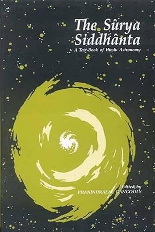
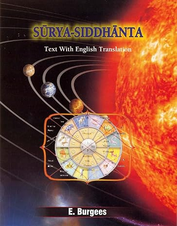

# Book References

## 

## Surya Siddhanta: A Textbook of Hindu Astronomy

**Publisher:** Motilal Banarsidass

**Year of Publication:** 1997

**ISBN:** 8120806123

**Language:** English

**Book ID:** [Amazon ID: 8120806123](https://www.amazon.com.au/Surya-Siddhanta-Textbook-Hindu-Astronomy/dp/8120806123/)

**Description:**
The Surya Siddhanta is an ancient Indian astronomical text that serves as a foundational work of Hindu astronomy. This edition provides an English translation of the original Sanskrit text.

**Table of Contents:**
1. Introduction
2. Cosmology
3. Planetary Positions
4. Solar and Lunar Eclipses
5. Calendar Calculations
6. Geometry and Trigonometry
7. Conclusion

**Cover Image Source:** [Amazon](https://www.amazon.com.au/Surya-Siddhanta-Textbook-Hindu-Astronomy/dp/8120806123/)

---

## 

## Surya-siddhanta: A Text With English Translation

**Translated by:** Ebenezer Burgess

**Publisher:** The Khemraj Shrikrishnadass

**Year of Publication:** 1997

**ISBN:** 8183150179

**Language:** Sanskrit (Original), English (Translation)

**Book ID:** [Amazon ID: 8183150179](https://www.amazon.com.au/Surya-siddhanta-text-English-Translation-Burgees/dp/8183150179)

**Description:**
The Surya Siddhanta is an ancient Indian astronomical treatise. This edition includes the original Sanskrit text along with an English translation by Ebenezer Burgess, providing insights into Hindu astronomical practices.

**Table of Contents:**
1. Introduction
2. Cosmology
3. Planetary Positions
4. Solar and Lunar Eclipses
5. Calendar Calculations
6. Geometry and Trigonometry
7. Conclusion

**Cover Image Source:** [Amazon](https://www.amazon.com.au/Surya-siddhanta-text-English-Translation-Burgees/dp/8183150179)

---

## 

## Surya Siddhanta: A Text-Book of Hindu Astronomy

**Publisher:** Kessinger Publishing, LLC

**Year of Publication:** 2010

**ISBN:** 1162575093

**Language:** English

**Book ID:** [Amazon ID: 1162575093](https://www.amazon.com/Surya-Siddhanta-Text-Book-Hindu-Astronomy/dp/1162575093)

**Description:**
The Surya Siddhanta is an ancient Indian astronomical text that serves as a fundamental work of Hindu astronomy. This edition provides an English translation of the original Sanskrit text.

**Table of Contents:**
1. Introduction
2. Cosmology
3. Planetary Positions
4. Solar and Lunar Eclipses
5. Calendar Calculations
6. Geometry and Trigonometry
7. Conclusion

**Cover Image Source:** [Amazon](https://www.amazon.com/Surya-Siddhanta-Text-Book-Hindu-Astronomy/dp/1162575093)

---

## 

## သူရိယသဒ္ဓိတ ၅ ဆင့် ဂြိုလ်သွားပြက္ခဒိန်

**Language** Burmese

---

- [Wikipedia](https://en.wikipedia.org/wiki/Surya_Siddhanta)

