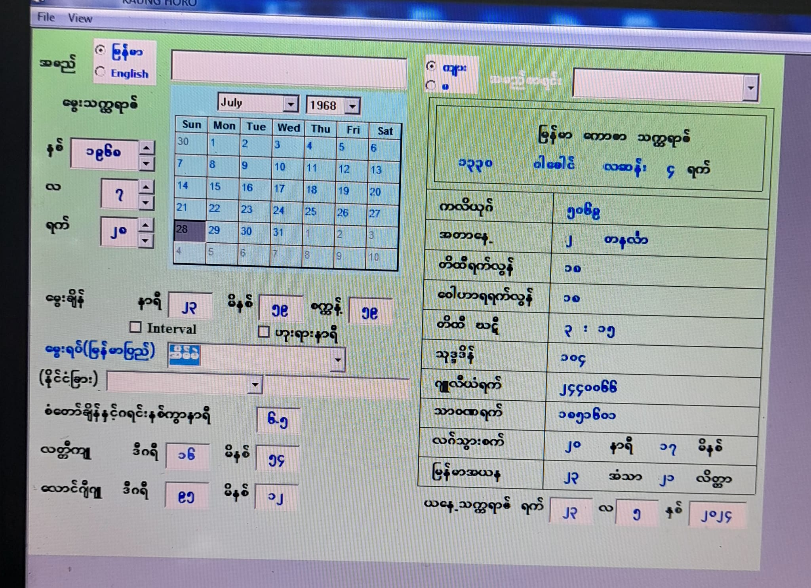
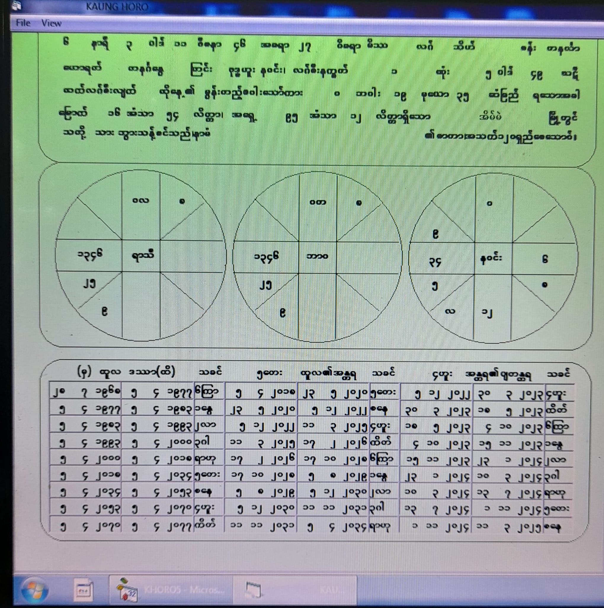


“ထူးထူးခြားခြား လေလံ”

“ နက္ခတ္တဗေဒ ဆိုင်ရာ ဇာတာဖွဲ့ ကွန်ပျူတာ

Programming Source Code”

လေလံ

နက္ခတ္တဗေဒ ပညာ ငယ်ငယ်ထဲက ဝါသနာ ပါခဲ့ပါသည်။ ရန်ကုန် ရောက်ပြီး ကွန်ပျူတာ ပညာလေး မတောက်တခေါက် တတ်လာတော့ ခေါင်ကစကိုင်ခဲ့မိ။ သူရိယသိဒ္ဓန္တ ကျမ်းကြီးကို ဆရာကြီး ဦးသန်းဌေး(ဝေဒ)၊ ပုဏ္ဏား ဆရာကြီး ကာလာစန် တို့ထံမှ သင်ယူပြီး ကွန်ပျူတာ ပညာရှင် ဆရာကြီး ဦးအောင်သန်းညွန့် (Soft Guide) ထံမှ programming ပညာ သင်ယူခဲ့ဘူးသောအခါ မြန်မာ့ ရိုးရာ ဇာတာ ဖွဲ့ရန် တွက်ရန် “ဂျောက် “ ခနဲဆို တြိစက္ကဇာတာ ၊ တိုင်ဆယ်ပါး ၊ ဒဿာ အပါအဝင် အင်္ဂလိပ် ရက် လ နှစ် ထည့်လိုက်ရင် မြန်မာ သက္ကရာဇ် ပါ ပေါ်လာအောင် အပင်ပန်းခံပြီး အချိန်များစွာပေးပြီး ဖန်တီးခဲ့ပါသည်။

ဤပရိုဂရမ်၏ထူးခြားချက်မှာ မူရင်းကျမ်းကြီးက Trigonomery function အသုံးပြုရာတွင်

Sin function တမျိုးတည်း ကိုသာအသုံးပြုခဲ့ပါသည်။

ထို့ကြောင့် ထောင့်မှန်ခံအနားအတွက်

ထပ်ခါထပ်ခါ အပင်ပန်းခံပြီး တွက်ခဲ့ရသည်ကို ကျနော်က Tangent function ပြောင်းတွက်လိုက်သောအခါ ထောင့်မှန်ခံအနား တွက်ရသည့်ဒုက္ခမရှိတော့ပါ။

နောက်တခုက နှစ်ပေါင်း ၄သန်း ၃သိန်း၂သောင်း တွက်လို့ရသည်။

တချို့ ပရိုဂရမ် တွေက limit ရှိသည်။

ရန်ကုန်စက်မှုတက္ကသိုလ် ပါမေက္ခချုပ် ဆရာကြီးဦးမင်းဝန် ခေတ်က တက္ကသိုလ်အဆောက်အဦး အမိုးပေါ်မှ နေကြတ် လကြတ် ဖြစ်စဥ်များကို သူရိယသိဒ္ဓန္တ ကျမ်းတွက်ရိုးဖြင့်

သုတေသန ပြုလုပ်ခဲ့ဘူးလေသည်။

ထိုသုတေသန ကို civil ကျောင်းသား

တချို့အား စာတမ်းများ ပြုစုခိုင်းခဲ့ဘူးပါသည်။

တကယ်တော့ ဗေဒင်ပညာ

အထူးသဖြင့် နက္ခတ္တဗေဒ ပညာသည် ယနေ့ကမ္ဘာတွင် မရှိမဖြစ်သော ပညာရပ်တခုပင်။ ဂြိုဟ်တု လွှတ်တင်မလား ၊ ယုတ်စွအဆုံး အဆောက်အဦး တခုဆောက်ရင်တောင် လွတ်လွတ်လပ်လပ် မြေနေရာမှာ ​ဆောက်ခွင့်ရပါက ဘယ် latitude မှာ ဘယ်အရပ်ကို မျက်နှာမျက်နှာမူပါက sun shade ကို ဘယ်လောက်ထားရမယ် ဆိုတာ declination သိမှရမှာ။ လူတယောက်ကို မျက်စိ ပိတ်ပြီး အဝေးတနေရာမှာ သွားချထား၊ နက္ခတ္တဗေဒ တွက်ရိုး တတ်သူက ဘယ်နေရာမှာ ရောက်နေလဲ ဆိုတာ သိပါတယ် ။ GPS မလိုပါ။ ဗေဒင် ပညာမှာ သုံးမျိုး ရှိသည်ဟု မှတ်သား ဘူးပါသည်။ ဂဏိတ ခေါ် အတွက် ၊ ဖလိတ ခေါ် အဟော ၊ သံဟိတ ခေါ် အစီအရင်ယတြာ ဟူ၏။ အတွက်ပညာသည် အခြေခံအကျဆုံး ဖြစ်လေသည် ။

ဗေဒင်ဆရာ သုံးမျိုး ရှိပါသည်။ Astrologer ၊ Fortune teller ၊ Seer တဲ့။ Seer ဆိုတာက အကြားအမြင်ဆရာပေါ့ ။ သူ့တွင်ပညာမရှိဟု ဆရာကြီး ပျဥ်းမနား ဦးသန်းမောင် ကဆိုသည်။

Fortune Teller ဆိုသူကမဟာဘုတ် သုံးတန်ပေါ်နိစ် ၊ သက်ရောက် ၊ ဂြိုဟ်အိပ်ဂြိုဟ်စား ၊ ဇနကကိန်း ၊ ဖဲချပ်၊ ကြက်ရိုး ၊ သစ်ရွက် စသဖြင့်

တခုခု ကြည့်ဟောတာ။ ကျနော် ဆိုလိုသည်က Astrology ပညာဖြစ်သည်။ နေ လ ဂြိုဟ် တို့၏ လှည့်လည်လယ်ပတ် နေပုံကိုမူတည်၍ အကောင်း အဆိုး ဟောပြောအပ်သော ပညာ ဖြစ်သတည်း။

ယနေ့ခေတ်တွင် ဇာတာဖွဲ့ software များပေါများလှပေသည်။ ကွန်ပျူတာအတွက်သာမက လက်ကိုင်ဖုန်းများတွင်မှာပါ တွက်ချက်နိုင်လေသည်။ထို့ကြောင့်ပင် ကျနော်၏ program သည်အထူးသဖြင့် ဗေဒင်ပညာဖြင့် အသက်မွေးဝမ်းကြောင်းပြုနေသူ ၊ ဗေဒင် ဟောစားသူတို့အတွက် အသုံးမဝင်သော်ငြား တွက်ရိုး ဝါသနာရှင် သုတေသီပညာ

လိုလားအမျိုးကောင်းသားများအ

တွက် အုတ်တချပ်သဲတပွင့် အထောက်အကူပြုမှာ မလွဲဧကန်ပင်။ ကျနော် ပေးမည်မှာ program တခုလုံး၏ source code ဖြစ်ပါသည် ။ ပြင်လို့ရပါသည်။ မိမိမူအဖြစ် ပြောင်းလဲ၍ ရပါသည်။

ဂြိုဟ်စင်တန်ဘိုးများမှာ ဆရာကြီး ကာလာစန် ၏ အတိုင်းဖြစ်ပါသည်။

မည်သူ့ကိုမှ မပေးရသေးပါ။လေလံအောင်သူ တယောက်ကိုသာပေးပါမည်။နောက်ထပ်လည်း မည်သူ့ကိုမှပေးမည်မဟုတ်ကြောင်း ကတိပြုပါသည်။ သို့သော် သံဒိဋ္ဌ ပြက္ခဒိန် ထုတ်ရောင်းခွင့် မပြုပါ။

ကျနော်စွန့်လွှတ်သင့်လွှတ်ချသင့်သည်များကိုစွန့်လွှတ်နေပြီဖြစ်ရကားနက္ခတ္တဗေဒ ဆိုင်ရာတွက်ရိုးနှင့် အဟော ကျမ်းစာအုပ်များစွာ ကို ဝါသနာပါသူများအားပေးအပ်ခဲ့ပြီးလေပြီ။ ဤ program ကို လွန်ခဲ့သောလေးငါးနှစ်က အများအတွက်လှူမည်ပေးမည်ဟုနိုင်ငံကျော်တယောက်နှင့်တိုင်ပင်သောအခါမင်းအလကားပေးရင်အလကားဖြစ်မှာဘဲ၊ မင်းကိုအကောင်းပြောမှာချီးမွမ်းမှာမဟုတ်ဘူး၊အပြစ်ပဲပြောလိမ့်မယ် ။ အမှားဘဲထောက်လိမ့်မယ်တဲ့။ ဒါကြောင့်လည်း 2002/2003 လောက်ထဲက ရေးပြီး သိမ်းထားတာ ခုထိ။ ဤ program စလုပ်ထဲက ထမင်းမေ့ ဟင်းမေ့။ ထမင်းစားပြီး မှန်းတောင်မသိ။ အမကြီးက ထမင်းနဲ့ ဟင်းနဲ့ နယ်ပြီး အနားမှာ လာထားပေးလို့သာ စားဖြစ်သွားတာ။

တကယ်တော့ ကွန်ပျူတာ လည်းပျက်တတ်တာပဲ၊ memory stick လည်းပျက်တတ်တာပဲ။ကျနော်သေသွားရင်ဆက်ခံမည့်သူမရှိ။ ပိုက်ဆံ လိုချင်လို့မဟုတ်ဘူး။

ယခုလိုချင်တဲ့သူ ယူထားပါရော့။

လေလံပစ္စည်း = မြန်မာ့ရိုးရာဇာတာဖွဲ့

computer program source code ( သူရိယသိဒ္ဓန္တ ကျမ်းမူ)

Visual basic 6 ဖြင့် ရေးထားသည်။

တွက်ချက် ရေးသားသူ = ပန်းချီ ကောင်းပိုင်

လေလံကြမ်းခင်းစျေး = ၂ သိန်းကျပ်

လေလံပြီးဆုံးချိန် = 26.5.2024

ည ၈ နာရီတိတိ။

လေလံတိုးနှုန်း ( 20,000 ) ကျပ်မှစ၍ တိုးနိုင်ပါသည်။

မူရင်းပို့စ်အောက် Commentတွင်သာ စျေးပေးပါခင်ဗျာ။

  

  Data ထည့်ရန် စာမျက်နှာ ။  
အင်္ဂလိပ် မြန်မာ နှစ်ဘာသာနဲ့ အမည်ရေးလို့ရတယ်။ နိုင်ငံခြားသား ကိုလည်း တွက်လို့ရအောင်ပေါ့။  
အင်္ဂလိပ် date of birth ထည့်လိုက်ရင် မြန်မာသက္ကရာဇ် ပေါ်နေလိမ့်မယ်။ limit တော့ရှိတယ်။  
မြန်မာ သက္ကရာဇ် ၁၂၆၃ ကနေ ၁၃၈၆ ထိ က အစိုးရ ပြက္ခဒိန် နဲ့အတူတူ၊ ၁၂၆၃ မတိုင်ခင်က နေ ကလိယုဂ် ဆန်း အထိက သီအိုရီ အတိုင်း တွက်ထားတော့ တရက် လောက်ကွာနိုင်တယ်။ ၁၃၈၆ နောက်ပိုင်း က တနှစ်ပြီးတနှစ် အစိုးရ မူအတိုင်း update လုပ်ပေးရမယ်။  
မြန်မာပြည် ရှိ မြို့ များ အားလုံး ( လွန်ခဲ့သော အနှစ်နှစ်ဆယ်ကျော်က) အတွက် latitude, longitude တွေ သိစရာ မလို ၊ အကုန်ထည့်ပေးထားတယ်။ ယခု မြို့ အသစ် တွေတော့ မပါဘူး။ နိုင်ငံတကာ မြို့ ဒေသ များစွာ ပါ ထည့်ထားတယ်။ latitude, longitude, စံတော်ချိန် မသိရင်ပေါ့။  
data ကို save ထားလိူ့ရတယ်။

  

တကယ်တော့ စ ဖန်တည်းတုန်းက ပေဖူး ထန်းဖူး ပုံစံ နှင့်ပါ၊ print ထုတ်လိုက်ရင် ထန်းဖူးဇာတာ အတိုင်းပါ၊ ဒါပေမည့် ကျနော် အလွန်မြတ်နိုးရပါသော ၊ တန်ဘိုးထားရပါသော ဇာတာ ( မြန်မာ့ ရိုးရာ ထန်းဖူးဇာတာ) ကျနော့လက်ရောက်မှ ကွန်ပျူတာ ပရင့် နဲ့ ထွက်လာတာ မလုပ်ချင်လို့ ရိုးရိုး လုပ်ထားတာ။

 
